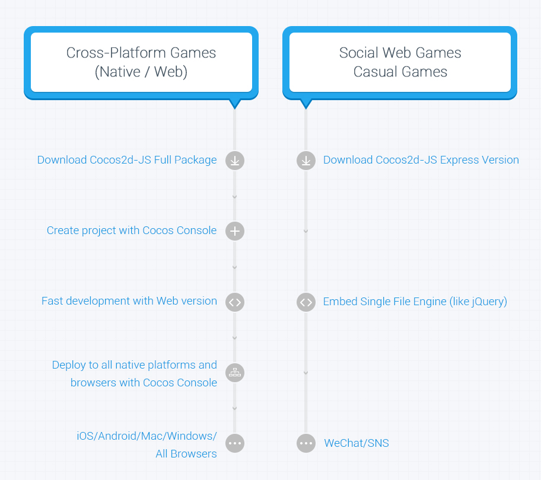

Cocos2d-JS
===========

Cocos2d-JS is Cocos2d-x engine's JavaScript version that includes Cocos2d-html5 and Cocos2d-x JavaScript Bindings. It equips your game with cross-browser and cross-platform abilities, accompanied by full Cocos2d-x features and simplified JavaScript friendly APIs.

Cocos2d-JS reinvented workflows for all platforms in v3.0, it provides a consistent development experience for whichever platform you want to distribute to, no matter web and native. "Code once, run everywhere" is incredibly easy and natural in Cocos2d-JS. With one single JavaScript code base, you can run your game on all web browsers and native platforms including Mac OS, Windows, iOS and Android. This will bring your game great opportunities in almost all channels of distribution. On the other hand, if you are only interested in casual games on the web, you can embed directly in your web page the Cocos2d-JS Lite Version which is extremely easy to use and light as a feather.

Furthermore, JavaScript friendly APIs make your game development experience a breeze - easy to code, test and distribute. In the meantime, Cocos2d-JS v3.0 is super powerful along with all these cool new features: Editors Support, Assets Manager, Object Pool, JS to Objective-C/JAVA reflection, etc.

## Workflows

- Cross platforms developers can use Cocos Console to create projects, boost their development with web version engine and deploy games onto all native platforms and all browsers with Cocos Console.

- Casual web game developers can download the Lite Version and start to develop just like using other web frameworks (e.g. jQuery).



## Downloads

- [Cocos2d-JS v3.0 Full Version](http://www.cocos2d-x.org/download)
- [Cocos2d-JS v3.0 Lite Version](http://www.cocos2d-x.org/filecenter/jsbuilder)
- [Online API reference](http://www.cocos2d-x.org/reference/html5-js/V3.0/index.html)
- [Downloadable API Reference](http://www.cocos2d-x.org/filedown/Cocos2d-JS-v3.0-API.zip)

## Online demos

- [MoonWarriors](http://www.cocos2d-x.org/MoonWarriors/index.html)
- [Testcase](http://www.cocos2d-x.org/js-tests/)

## Documentations

- [Getting Started with Cocos2d-JS](http://www.cocos2d-x.org/docs/manual/framework/html5/en)
- [Cocos2d-JS release notes](http://www.cocos2d-x.org/docs/manual/framework/html5/release-notes/en)
- [Cocos2d-JS v3.0 upgrade guide](http://www.cocos2d-x.org/docs/manual/framework/html5/release-notes/v3.0rc0/upgrade-guide/en)

## About Cocos2d family

- Cocos2d-JS v3.0 uses Cocos2d-x 3.2 final as base of JSB solution
- Cocos2d-JS v3.0 is compatible with Cocos Code IDE v1.0.0 RC2+
- Cocos2d-JS v3.0 is compatible with Cocos Studio v1.2 - v1.5.0.1

With any problems you might have, our communities are happy to help:

- [Online forum](http://discuss.cocos2d-x.org/category/cocos2d-x/javascript)
- [Document root](http://cocos2d-x.org/docs/manual/framework/html5/en)
- [Github repository](https://github.com/cocos2d/cocos2d-js)

## How to Start a New Game

1. Download the code from [Cocos2d download site](http://www.cocos2d-x.org/download)
2. Run `setup.py`
3. Run the `cocos` script

Example:

    $ cd cocos2d-js
    $ ./setup.py
    $ source FILE_TO_SAVE_SYSTEM_VARIABLE

    $ cocos new MyGame -l js -d /directory/to/project
    $ cd /directory/to/project/MyGame

###Run the project under the game directory

* Run Cocos2d-html5 project with a Websever:

	```
	cocos run -p web
	```

* Compile and run project in Cocos2d-JSB :

	```
	cocos compile -p ios|mac|android|web
	cocos run -p ios|mac|android|web
	```

You may need to provide your Android NDK, Android SDK and ANT's paths during the setup. Note that this tool is developed with python, so you will need python (32bit) 2.7.5 or later installed on your machine (but it doesn't support Python3). Please refer to [Cocos Console document](http://www.cocos2d-x.org/docs/manual/framework/html5/v2/cocos-console/en).

And if you have any doubt about the usage, please use `-h` with any command to have some help messages.

You can also use prebuilt Xcode or Visual Studio projects which are located in `Game/frameworks/runtime-src/proj.xxx`

##Folder structure of new project

- frameworks
    - cocos2d-html5     : Cocos2d-JS html5 engine source
    - js-bindings       : JSB engine source (include Cocos2d-x and JSB)
    - runtime-src       : IDE projects (Android, iOS, Mac OS, Win32)
- publish               : Published apps
- runtime               : Debug app files
- tools                 : JS Bindings generator
- res                   : Your game resource folder for images, sounds, etc
- src                   : The source code folder to place your game's js files
- main.js               : The entrance of your game logic
- index.html            : The web page for hosting your game in web server

##Built-in Projects

There are two prebuilt projects in Cocos2d-JS repo:

- Test cases, located in `samples/js-tests`

 ```
 cd samples/js-tests
 run -p ios|mac|android|web
 ```
- Game sample : Moon Warriors, located in `samples/js-moonwarriors`

```
cd samples/js-moonwarriors
run -p ios|mac|android|web
```
And they share the same project files which are located in `build` folder, there are Xcode and Visual Studio projects.

##Main features

   * Support All modern browsers and native platforms
   * Scene management (workflow)
   * Transitions between scenes
   * Sprites and Sprite Sheets
   * Effects: Lens, Ripple, Waves, Liquid, etc.
   * Actions (behaviours):
     * Trasformation Actions: Move, Rotate, Scale, Fade, Tint, etc.
     * Composable actions: Sequence, Spawn, Repeat, Reverse
     * Ease Actions: Exp, Sin, Cubic, Elastic, etc.
     * Misc actions: CallFunc, OrbitCamera, Follow, Tween
   * Basic menus and buttons
   * Integrated with physics engines: [Box2d][5] and [Chipmunk][6]
   * Particle system
   * Skeleton Animations: [Spine][7] and Armature support
   * Fonts:
     * Fast font rendering using Fixed and Variable width fonts
     * Support for .ttf fonts
   * Tile Map support: Orthogonal, Isometric and Hexagonal
   * Parallax scrolling
   * Motion Streak
   * Render To Texture
   * Touch/Accelerometer on mobile devices
   * Touch/Mouse/Keyboard on desktop systems
   * Sound Engine support (CocosDenshion library) based on OpenAL or WebAudio on web
   * Integrated Slow motion/Fast forward
   * Fast and compressed textures: PVR compressed and uncompressed textures, ETC1 compressed textures, and more
   * Resolution Independence
   * Modularized engine for customization
   * Open Source Commercial Friendly: Compatible with open and closed source projects
   * OpenGL ES 2.0 (mobile) / OpenGL 2.1 (desktop) based
   * Full WebGL support and auto canvas fallback

## Notice

For JSB build, there are some restrictions :

- [Android build] NDK version must be r9d
- [iOS build] Xcode version must be 5.1.1 +

##Github note

If you fork our github repository or download the package from github, you will need to do some extra tasks:

- Run `git submodule update --init --recursive` in the `cocos2d-js` root folder, to init and update submodules recursively, such as `cocos2dx/plugin`.
- Run `frameworks/js-bindings/cocos2d-x/download-deps.py` to download external dependencies for Cocos2d-x
- Run `tools/cocos2d-console/download-bin.py` to download bin files for some cocos2d-console plugins like Google Closure Compiler and JSC Compiler.

Otherwise, you will fail to compile your JSB projects.

## Roadmap

Cocos2d-JS have greatly simplified cross platform development. For the next step, we will focus on improving performance on mobile web, toolchain enhancement and completing documentation. Here is a list of main tasks we consider to accomplish in v3.1 :

- The research for performance improvement on Web engine have already made great progress, the new renderer for canvas render mode is ready and will be merged in v3.1. The performance is upto 50% better than v3.0 based on various tests.
- Facebook SDK for Cocos2d-JS will be released with v3.1, developers can use all Facebook features on iOS/Android/Web with the same JavaScript code.
- Continue the research of memory model in JSB, improve the stability and simplify the usage.
- Complete the Cocos2d-JS Programming Guide document to cover all important aspects about Cocos2d-JS development.
