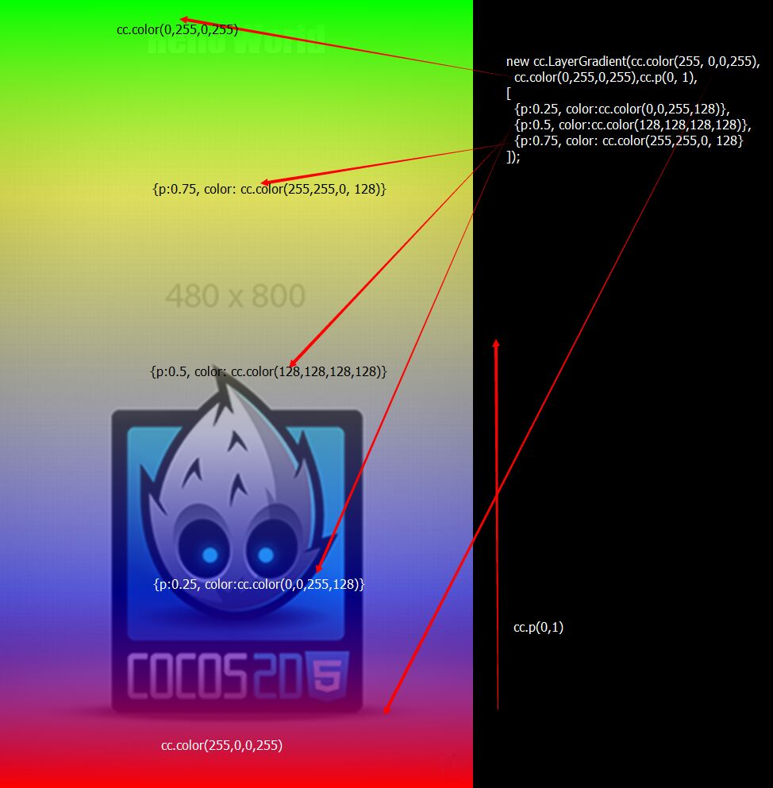

#Upgrade guide from Cocos2d-JS v3.3 to Cocos2d-JS v3.4

## 0. Upgrade to Cocos2d-JS v3.3

If you are still using Cocos2d-html5 or previous version of Cocos2d-JS, you may need to read the previous upgrade guides first : [Historic upgrade guides](../../en.md)

## 1. Pulish to Windows Phone 8 (Windows Phone 8.1 is not supported yet)

Follow these steps can help you upgrade to v3.4, then create a project and at last working for Windows Phone 8.

1. You need to upgrade cocos console with the `setup.py` in Cocos2d-JS v3.4 package:

    ```
    $ cd cocos2d-js-v3.4
    $ ./setup.py
    ```
    
2. Create a Cocos2d-JS v3.4 project:

    ```
    $ cocos new -l js WinPhone8Game
    ```
    
3. Open the Windows Phone 8 project in `WinPhone8Game/frameworks/runtime-src/proj.wp8-xaml/WinPhone8Game.sln`. Note that you need Visual Studio 2012 to open it.

4. Now you can start to compile or publish the Cocos2d-JS project for Windows Phone 8.

## 2. [Native Exclusive] Create 3D games

The biggest feature in Cocos2d-JS v3.4 is the 3D modules. We have bound Cocos2d-x's 3D modules to JSB, so that you can now code 3D games using JavaScript. Please note that it's a native engine exclusive feature, you can not use 3D classes in the web engine. We are not planning to support 3D for the web in the near future.

Sorry that we don't have a JavaScript document for 3D modules, we will add them as soon as possible.

To know how to use the new 3D modules, please refer to the following documents:

- Cocos [3d module's API reference](http://www.cocos2d-x.org/reference/native-cpp/V3.4/dir_0cec398151724e9e1c180a4e8f99801b.html)
- Cocos [Camera API reference](http://www.cocos2d-x.org/reference/native-cpp/V3.4/d6/d2b/classcocos2d_1_1_camera.html)
- Cocos [Light API reference](http://www.cocos2d-x.org/reference/native-cpp/V3.4/d2/d85/classcocos2d_1_1_base_light.html)
- Test cases in the Cocos2d-JS v3.4 package, run it with projects in `build` folder or using `cocos run` command under `samples/js-tests` folder. You can refer to the following test cases:
    - BillBoardTest: source code in `samples/js-tests/src/BillBoardTest`.
    - Camera3DTest: source code in `samples/js-tests/src/Camera3DTest`.
    - LightTest: source code in `samples/js-tests/src/LightTest`.
    - Sprite3DTest: source code in `samples/js-tests/src/Sprite3DTest`.
    
## 3. [Web Exclusive] cc.LayerGradient with color stops

In the web engine of Cocos2d-JS v3.4, you can now define color stops for a layer gradient. It's a web exclusive feature but it's safe to use the same code in native engine.

API:

```
new cc.LayerGradient(beginColor, endColor, positionInPercent, colorStops);
```

Sample code:

```
// Color stops is represented by an array, where each entry is an object composed by positionInPercent and the color.
var colorStops = [
                    {p: 0.25, color: cc.color(0, 0, 255, 128)},
                    {p: 0.5, color: cc.color(128, 128, 128, 128)},
                    {p: 0.75, color: cc.color(255, 255, 0, 128)}
                ];

var gradient = new cc.LayerGradient(cc.color(255, 0, 0, 255), cc.color(0, 255, 0, 255), cc.p(0, 1), colorStops);
this.addChild(gradient, 10);
```

Result:


